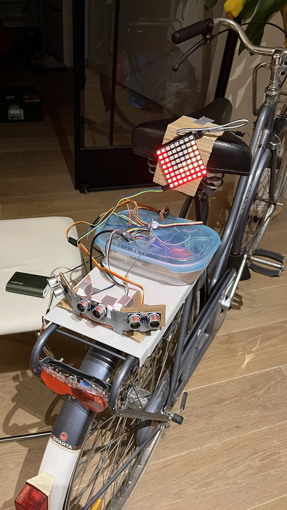
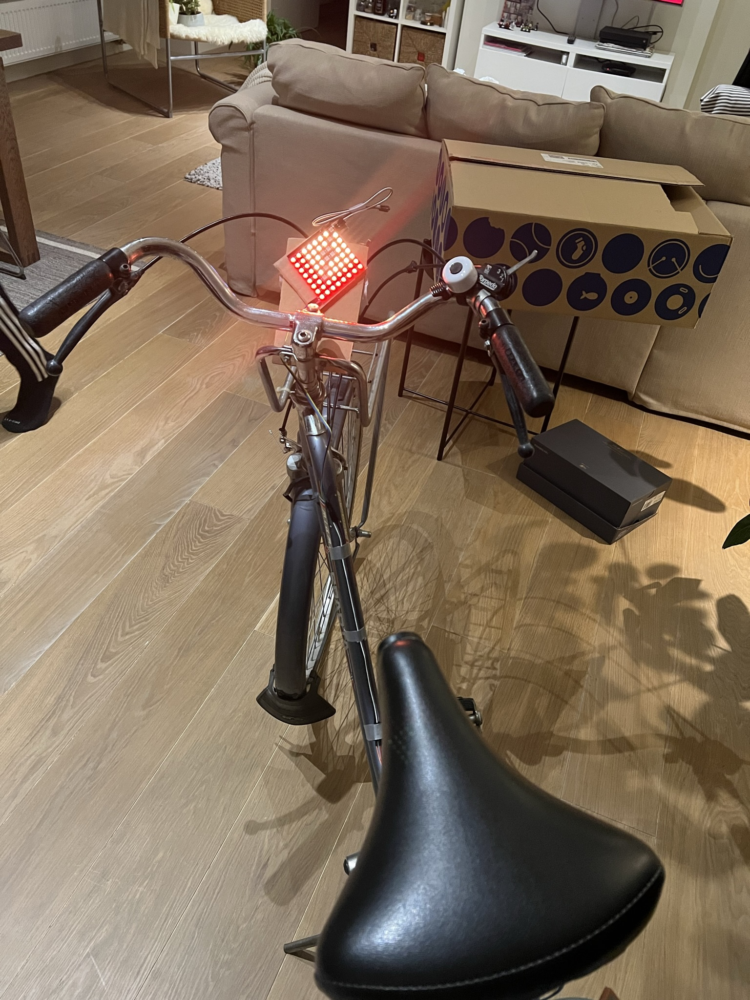
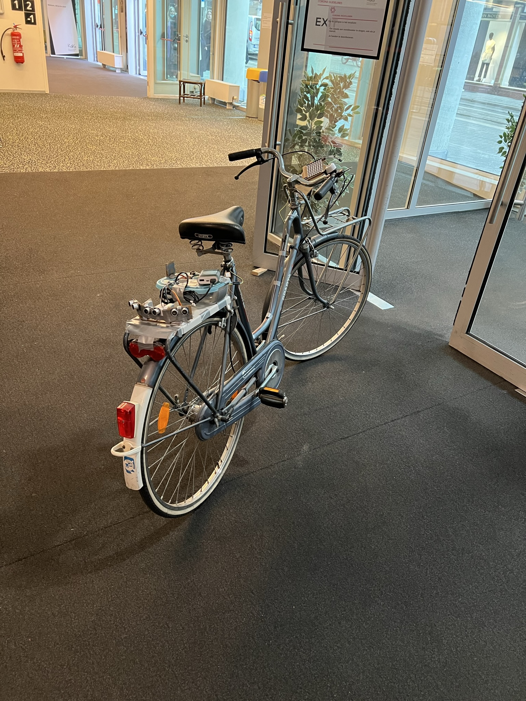
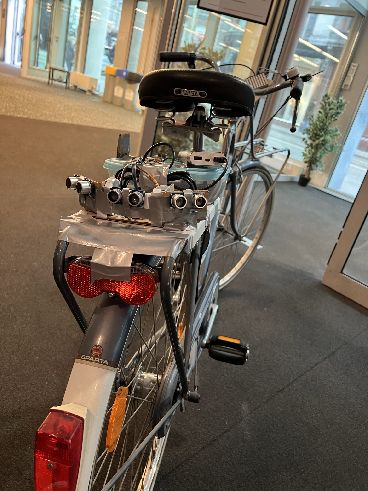
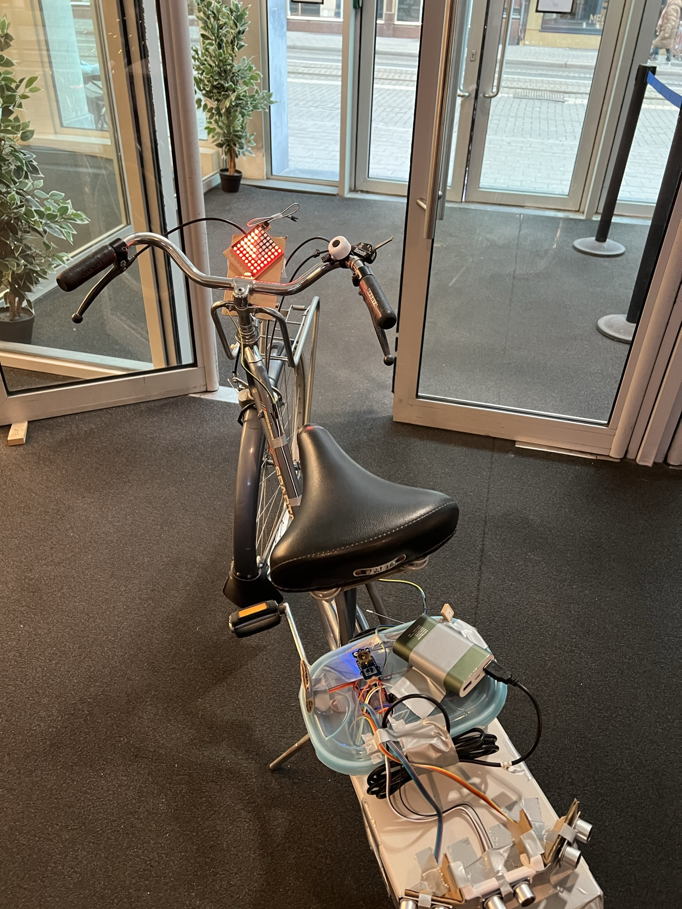

# SafeSpot
SafeSpot is a school group project that helps cyclists to be more aware of their surroundings. It can detect any object that is in the blind spots. This helps cyclists to be more confident and catious on the road.

There are 3 ultrasonic sensors to detect all objects (including approaching vehicles or pedestrians), and a RGB LED display at the front to warn the cyclists what's around them.

## Contributors
- [Ihsan Hepsen](https://github.com/ihsan-hepsen)
- [Elias Henni](https://github.com/elias-henni)
- [Samantha Ngong](samanthank38@gmail.com)

## Technologies
- Arduino Uno (ATmega328P)
- Ultrasonic Sensor (HCSR04_H)
- RGB LED Matrix 
- C/C++ Programming Languages

## Photos

